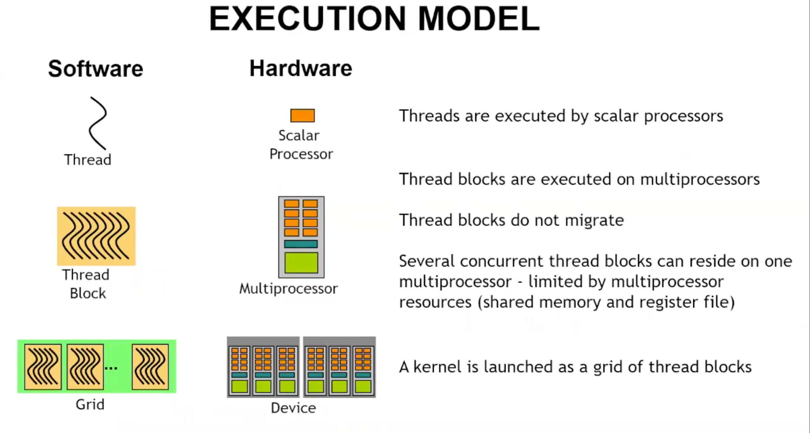

## 术语

- prefill：将输入的的整段prompt都喂给模型，计算对应的kv cache

## prefix cache

每一个块都会计算一个hash，如果一个块有前缀，会在计算的时候加上块的前缀块

比如块A={1,2,3,4}  H1 = hash(A).  B = {2,3,4,5} H2 = {H1 + B)

因为kv cache是上下文相关的，所以block也是上下文相关的

# gpu

关键词

## **_shared__ to declare a array in shared memory**

## execution barrier

_syncthreads(). 同一个块内的所有的线程都必须达到这个语句之后，才可以执行后面的代码

常见模式，共同加载共享内存，在一个非条件语句中放置同步线程模型，确保所有的数据都ready

## dram shared-memory
当用到一个字节的时候，dram会发送32个字节，占用32个字节的传输带宽
access dram by segment not by byte
共享内存不需要连续的内存访问

## gpu 架构
* 双发射：一个wrap scheduler在一个时钟周期内部从同一个指令流中连续发出两条相邻的指令
* software model: 基础单元是线程，这些线程被组织成线程块，线程块有组织成了grid 
grid是一次内核启动所有的线程块的集合
* wrap：一个线程束由32个线程组成 一般情况下以wrap为单位执行指令，

1. 线程被scalar processor处理的，也就是cuda core/sp，
2. 线程块被sm处理
3. 一个thread block一旦被一个sm占用，就不会更换
4. 一个sm可以驻留多个core，但是最后不会进行

## cuda configuration
1. 单个线程内部的指令还是按照顺序发射执行的。
2. 当一条指令需要的数据没有准备好，会stall(停顿)
Memory read by itself doesn't stall execution 在读内存的时候gpu会调度其他的线程，所以 GPU 用大量线程隐藏内存延迟。这就是Latency hiding（延迟隐藏）
3. Latency is hidden by switching threads 读取global memory需要>100cycle,计算<100cycles

## two key points 
make sure to use enough threads to hide latency 512-2048 
一般的sm有64个wrap 每一个拥有32个线程 2048个线程
线程块是wrap的整数倍

## shared memory
共享内存的组织形式是以块为单位的，每一个进程块的共享内存是隔离的
每一个进程的顺序都是不固定的，为了防止数据竞争，在一些步骤需要同步，比如加载数据
共享内存的存储形式，是按照bank存储的，一共有32个bank，按照地址%32存放

读取共享内存的时候按照wrap读取，每次读取32个，如果x = sdata[threadIdx.x];
thread0 读 sdata[0]
thread1 读 sdata[1]
thread2 读 sdata[2]
...
thread31 读 sdata[31]
就是不冲突
但是如果x = sdata[threadIdx.x * 32];

现在：
thread0 -> sdata[0]
thread1 -> sdata[32]
thread2 -> sdata[64]
thread3 -> sdata[96]
所有的线程都访问bank0，就会冲突，会分多次取数，并行变成串行

一个 warp 的 32 个线程，它们的 index 会不会落到同一个 bank？ 来判断是否冲突

## global memory thoughput

## reduction
atomic add
read modify write 一次性

## classical parallel reduction

## gpu并行的矩阵写法
可以把线称号当作一个循环
 size_t idx = threadIdx.x+blockDim.x*blockIdx.x;这一句话里面会有blockdim * griddim个线程会执行，因此一个stride就是blockdim * griddim 
一定要记住共享内存就是每一个块中都有一个，总量由硬件决定，怎么切给每个 block 由程序员的 kernel 写法决定，最终能同时放多少 block 由 GPU 调度。